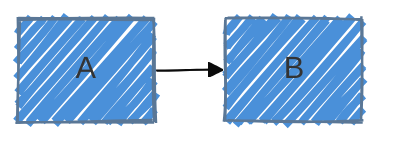
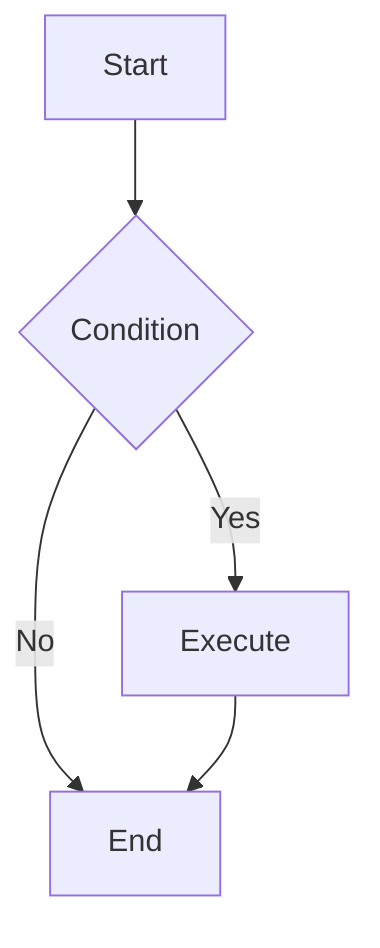

# Mermaid Diagram Generator

<context>

Mermaid renders diagrams from plain text — version-controllable, embeddable in GitHub/GitLab/Notion/Obsidian, no external tools required. All diagrams follow one pattern:

```text
diagramType direction
  definition content
```

The **first line must be the exact diagram type keyword** (e.g., `flowchart TD`, `sequenceDiagram`, `erDiagram`). Unknown keywords and typos fail silently — always validate in [Mermaid Live](https://mermaid.live).
</context>

## Step 1 — Route to Diagram Type

<routing>

Map the **intent** (what to show) to a type — not the user's suggested label. Users often misname the type they need.

**Small-model decision gate:** check these before falling back to `flowchart`:

1. Boxes are actions or decisions → `flowchart`
2. Boxes are statuses or conditions of one entity → `stateDiagram-v2`
3. Two or more actors exchange messages over time → `sequenceDiagram`
4. Tables, keys, and cardinality → `erDiagram`
5. Classes, methods, visibility, or inheritance → `classDiagram`
6. Systems, containers, components, or deployment boundaries → C4 / `architecture-beta` / `block-beta`
7. Values, proportions, time series, flow volume, or multi-axis scores → quantitative diagram
8. Only spacing/layout/style is wrong → keep the semantic diagram type and adjust config

**Behavioral** — dynamics, interactions over time:

| Intent / What to show | Diagram type | Reference |
| --- | --- | --- |
| Actions, decisions, algorithm flow | `flowchart` | [references/flowchart.md](references/flowchart.md) |
| Multi-actor message passing | `sequenceDiagram` | [references/sequenceDiagram.md](references/sequenceDiagram.md) |
| Single-entity lifecycle / state transitions | `stateDiagram-v2` | [references/stateDiagram.md](references/stateDiagram.md) |
| User sentiment / experience phases | `journey` | [references/userJourney.md](references/userJourney.md) |
| Sequence with code-style syntax | `zenuml` | [references/zenuml.md](references/zenuml.md) |

**Structural** — static architecture at a point in time:

| Intent / What to show | Diagram type | Reference |
| --- | --- | --- |
| OOP classes, inheritance, methods | `classDiagram` | [references/classDiagram.md](references/classDiagram.md) |
| Database tables, FK/PK, cardinality | `erDiagram` | [references/entityRelationshipDiagram.md](references/entityRelationshipDiagram.md) |
| System context / container / component (formal) | `C4Context` / `C4Container` / `C4Component` ⚠️ | [references/c4.md](references/c4.md) |
| Cloud infra, network zones, service icons | `architecture-beta` ⚠️ | [references/architecture.md](references/architecture.md) |
| Component blocks, module wiring | `block-beta` ⚠️ | [references/block.md](references/block.md) |
| Network packet / protocol structure | `packet-beta` ⚠️ | [references/packet.md](references/packet.md) |
| Requirements → system → test traceability | `requirementDiagram` | [references/requirementDiagram.md](references/requirementDiagram.md) |

**Temporal** — time-oriented:

| Intent / What to show | Diagram type | Reference |
| --- | --- | --- |
| Project schedule, parallel tasks, duration | `gantt` | [references/gantt.md](references/gantt.md) |
| Historical chronology, milestones | `timeline` | [references/timeline.md](references/timeline.md) |
| Git branches, commits, merges | `gitGraph` | [references/gitgraph.md](references/gitgraph.md) |

**Analytical / Conceptual**:

| Intent / What to show | Diagram type | Reference |
| --- | --- | --- |
| Concept clusters, brainstorming | `mindmap` | [references/mindmap.md](references/mindmap.md) |
| 2-axis prioritization / BCG / effort-impact | `quadrantChart` | [references/quadrantChart.md](references/quadrantChart.md) |
| Task board, WIP limits | `kanban` | [references/kanban.md](references/kanban.md) |

**Quantitative** — data-driven:

| Intent / What to show | Diagram type | Reference |
| --- | --- | --- |
| Part-to-whole proportions | `pie` | [references/pie.md](references/pie.md) |
| Line / bar data series | `xychart-beta` ⚠️ | [references/xyChart.md](references/xyChart.md) |
| Flow volume / conversion funnel | `sankey-beta` ⚠️ | [references/sankey.md](references/sankey.md) |
| Multi-axis comparison (radar / spider) | `radar` ⚠️ | [references/radar.md](references/radar.md) |
| Hierarchical data by volume | `treemap` | [references/treemap.md](references/treemap.md) |

> ⚠️ = experimental / beta — not supported in all renderers. Prefer fully supported diagram types by default. If a ⚠️ type might fit, ask before using it unless the user explicitly requested that type.

**When two types still fit:** ask one clarifying question before generating (e.g., "Is each box a status/condition or an action/step?"). If a structured question tool is available, such as `vscode_askQuestions` or some tool that allows for confirmation and question asking, prefer it for decisions that change diagram type, renderer compatibility, or config strategy. Use `flowchart` as a last resort only — it loses semantic precision. When types seem interchangeable, read [docs/diagram-routing.md](docs/diagram-routing.md) for the full decision tree and interchangeability traps.
</routing>

## Step 2 — Read Syntax Reference

<instructions>

Open the `references/` file linked in the routing table **before generating**. Mermaid has type-specific syntax that silently breaks diagrams if ignored:

- Exact first-line keywords differ between types — never generate from memory
- Relationship notation differs per type (`-->` vs `-->>` vs `--|{`)
- Some types forbid special characters in labels (`{}`, `()` must be quoted)
- `sequenceDiagram` reserves `end` as a keyword — do not use it as a participant name
- If adding YAML config keys, read [docs/mermaid-config-variables.md](docs/mermaid-config-variables.md) to verify exact names, defaults, root-level vs diagram-specific placement, and renderer-sensitive options
- If using layout config, read [docs/layout-configuration-guide.md](docs/layout-configuration-guide.md) before adding YAML frontmatter
- If using color, theme, readability, or palette config, read [docs/styling-and-readability-guide.md](docs/styling-and-readability-guide.md)
- If choosing arrows or relationship operators, read [docs/arrow-semantics-guide.md](docs/arrow-semantics-guide.md) and make the operator match the relationship semantics
- If labels contain math notation, read [docs/math-support-guide.md](docs/math-support-guide.md) before embedding formulas
- If the user wants a starting point, use [templates/README.md](templates/README.md) and adapt the closest template

>[!IMPORTANT]
>Ask the user if not specified with tools as `vscode_askQuestions` or similar.
</instructions>

## Step 3 — Generate

<rules>

- Wrap output in ` ```mermaid ` fences — required for rendering on all platforms
- First line must be the **exact** type keyword and direction (e.g., `flowchart TD`, `sequenceDiagram`, `erDiagram`)
- Use semantic names matching domain concepts, not generic `A`, `B`, `C`
- Use `%%` prefix for inline comments explaining non-obvious relationships
- Indent sub-elements consistently — reduces parse errors
- One diagram, one concept — split large subjects into multiple focused views
- Use semantically appropriate arrows and relationship operators; do not default every edge to `-->`
- Apply non-semantic adjustments in this order: readability/fit config → theme palette → semantic `classDef` node classes
- Add a YAML config block only when readability, theming, math, or layout actually matters, not by default
</rules>

## Step 4 — Apply Styling (when needed)

Configure via YAML frontmatter **inside** the mermaid fence, placed before the diagram type keyword:



| Option | Values |
| --- | --- |
| `theme` | `default` · `forest` · `dark` · `neutral` · `base` |
| `look` | `classic` (default) · `handDrawn` |
| `layout` | `dagre` (default) · `elk` · `tidy-tree` |

Config routing:

| Need | Prefer | Note |
| --- | --- | --- |
| Ordinary layered graph | no config or `dagre` | most portable |
| Fit, spacing, wrapping, or size | `flowchart.nodeSpacing` / `rankSpacing` / `wrappingWidth` / `diagramPadding` | adjust up or down based on the problem |
| Complex flowchart with crossing edges | ask before `layout: elk` | renderer support varies |
| Dense relationship clusters | prefer semantic diagram choice or keep default layout and tune spacing | avoid undocumented force-directed layout routes |
| Mindmap or hierarchy | ask before `layout: tidy-tree` | official docs mainly show mindmap usage |
| Visual style only | `theme`, `themeVariables`, `look` | apply after readability config |
| Unreadable on dark/light background | palette preset from `templates/` | choose contrast before decoration |
| Special node categories | `classDef` and `class` | use only for semantic categories after base readability/palette works |

Syntax policy:

- Use YAML frontmatter `config:` for new diagrams.
- Verify new or uncommon config keys in [docs/mermaid-config-variables.md](docs/mermaid-config-variables.md) before generating them.
- Do not generate legacy directive syntax for new diagrams or templates. If old user input contains directives, convert or explain conversion at a high level.
- Do not reach for CSS. This skill standardizes Mermaid-native config and `classDef` only.
- Use `classDef` and `class` for semantic node categories after readability config and palette are stable.

Primary docs: [docs/mermaid-config-variables.md](docs/mermaid-config-variables.md) · [docs/layout-configuration-guide.md](docs/layout-configuration-guide.md) · [docs/styling-and-readability-guide.md](docs/styling-and-readability-guide.md) · [docs/arrow-semantics-guide.md](docs/arrow-semantics-guide.md) · [docs/math-support-guide.md](docs/math-support-guide.md) · [templates/README.md](templates/README.md). Use autogenerated references only to verify exact syntax for the selected diagram/config.

## Output Format

<output_format>

Every response must include:

1. The diagram in a ` ```mermaid ` block with valid, renderable syntax
2. A one-line description of what the diagram shows
3. (Optional) A rendering note if the platform context is relevant



*Process flow: decision branch routing to two terminal states.*
</output_format>

## Gotchas

<gotchas>

- **Silent failures**: Mermaid renders nothing if a keyword is misspelled or unsupported — validate in [Mermaid Live](https://mermaid.live) before committing.

- **Exact first-line keywords matter**: Use `stateDiagram-v2` (not `stateDiagram`); `gitGraph` (not `gitgraph`); `C4Context` / `C4Container` / `C4Component` for C4 levels; beta types use their suffixed names (`xychart-beta`, `sankey-beta`, `architecture-beta`, `block-beta`, `packet-beta`).

- **Experimental types not universal**: `architecture-beta`, `block-beta`, `packet-beta`, `xychart-beta`, `sankey-beta`, `radar`, and C4 types are unsupported by some renderers — GitHub markdown does not render `architecture-beta`.

- **Reserved word `end`**: In `sequenceDiagram`, `end` is a reserved keyword. Using it as a participant name breaks the diagram without an error message.

- **Special characters in labels**: `{}`, `()`, `[]` inside node text must be quoted: `A["label with {braces}"]`.

- **YAML config placement**: The `---config:---` block goes **inside** the ` ```mermaid ` fence, before the type keyword. Placing it outside makes it invisible to Mermaid.

- **Legacy directives**: Do not use directive syntax for new output. Only mention it when converting old diagrams to YAML frontmatter.

- **Theme contrast**: If a diagram has a fixed dark or light background, set readable `themeVariables` instead of hoping defaults work. Low-contrast node fill/text pairs make diagrams technically rendered and practically useless.

- **Arrow semantics**: `-->` is not a universal relationship operator. Use flowchart dotted/thick/cross/bidirectional links for meaning, sequence `->>` for requests and `-->>` for returns, class UML operators for ownership/dependency/inheritance, and ER cardinality markers for database relationships.

- **Mermaid math**: Use KaTeX `$$...$$` only for tested flowcharts and sequence diagrams. Quote flowchart labels, keep sequence messages unquoted with single LaTeX backslashes, avoid mixing Markdown formatting with math, and treat GitHub Markdown as unreliable for exact math rendering.

- **ER ≠ Class**: `erDiagram` models database persistence (cardinality, FK/PK) — no methods. `classDiagram` models OOP structure (methods, visibility, inheritance). They are not interchangeable.

- **State ≠ Flowchart**: If every box is a status/condition (a noun), use `stateDiagram-v2`. If every box is an action/step (a verb), use `flowchart`. Forcing the wrong type strips semantic meaning.

- **Flowchart ≠ Sequence**: When ≥2 actors communicate over time, use `sequenceDiagram` — flowcharts lose the multi-actor temporal axis and async/sync message distinction.

- **ELK layout**: Only available when Mermaid is integrated with the ELK engine — not available on GitHub, most wikis, or basic integrations.

- **Layout config ≠ diagram semantics**: Use config to improve readability after choosing the correct diagram type. Do not turn databases, classes, lifecycles, or quantitative data into flowcharts just because layout is easier.

- **Tidy-tree knobs**: `tidy-tree.direction`, `tidy-tree.levelSpacing`, and `tidy-tree.nodeSpacing` are not clearly documented as portable Mermaid config. Use them only after target-renderer validation.
</gotchas>

---

User requirements: $ARGUMENTS
