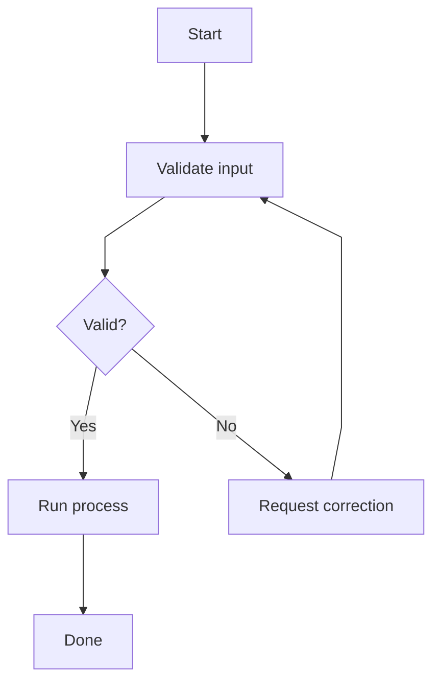
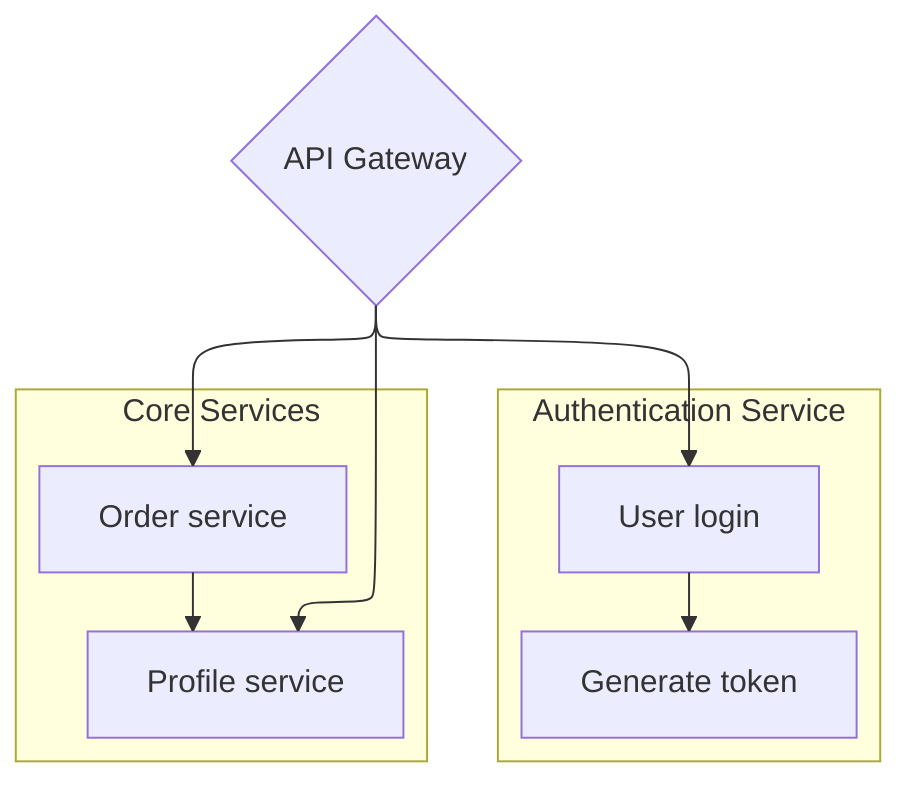
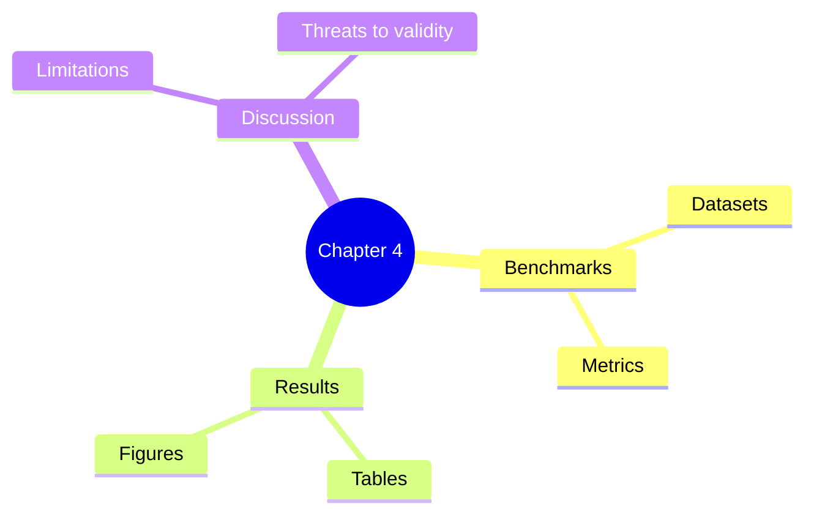

# Mermaid Layout Configuration Guide

Use this guide when the diagram type is already known and the remaining problem is readability, spacing, layout, or visual style.

## Rules of Thumb

- Choose the semantic diagram type first. Use layout config to improve readability, not to replace the right diagram type.
- Keep config minimal. Add YAML frontmatter only when readability, layout, or styling materially improves the diagram.
- Put frontmatter inside the ` ```mermaid ` fence, before the diagram type keyword.
- Prefer documented config keys for portable Markdown. Mark renderer-sensitive or locally observed keys as experimental.
- Verify exact config key names, defaults, and root-level vs diagram-specific placement in [mermaid-config-variables.md](mermaid-config-variables.md) before using uncommon options.
- Ask before choosing a non-default layout when more than one layout may fit.
- When the target renderer is unknown, include a short rendering note for beta diagrams, C4 diagrams, and non-default layouts.

## Layout Choice Matrix

| Need | Prefer | Why | Caveat |
| --- | --- | --- | --- |
| Ordinary layered flow | Default / `dagre` | Most portable Mermaid layout | Often enough; no config needed |
| Complex flowchart with crossings | Ask before `layout: elk` | Better edge routing for larger directed graphs | ELK support varies by renderer |
| Tree or hierarchy | Ask before `layout: tidy-tree` | Useful for mindmaps and hierarchical data | Official docs mainly show mindmap usage |
| More flowchart spacing | `flowchart.nodeSpacing` and `flowchart.rankSpacing` | Documented flowchart-specific spacing | Does not solve wrong diagram semantics |
| Different visual style | `theme`, `themeVariables`, `look` | Portable styling path when frontmatter is supported | Apply after readability config |

## Ask Before Layout Change

Keep the default layout unless the user explicitly requests another layout or the current diagram has a clear placement/routing problem.

Ask with a structured question when:

- `elk` and `tidy-tree` could both plausibly fit.
- The renderer target is GitHub, Obsidian, VS Code, or unknown.
- The layout requires renderer-sensitive parameters.
- Changing layout might change how the user interprets the diagram.

Recommended options:

- Default/dagre for portable layered flow.
- ELK for complex directed flowcharts with crossings.
- Tidy-tree for mindmaps and hierarchy.
- Not sure: keep default and tune spacing first.

## Portable Flowchart Spacing

Use this when a flowchart is semantically correct but nodes are cramped.

````markdown

````

Useful documented flowchart keys:

| Key | Use |
| --- | --- |
| `flowchart.nodeSpacing` | Space between nodes on the same level |
| `flowchart.rankSpacing` | Space between graph ranks or layers |
| `flowchart.curve` | Edge curve style, such as `basis`, `linear`, `step`, or `rounded` |

## ELK Recipe

Ask before using ELK. Use it for larger directed flowcharts, service dependency maps, or diagrams where default routing creates many crossings.

````markdown

````

Common documented ELK keys:

| Key | Use |
| --- | --- |
| `elk.mergeEdges` | Try to bundle parallel edges |
| `elk.nodePlacementStrategy` | Choose node placement strategy, for example `NETWORK_SIMPLEX` |
| `elk.cycleBreakingStrategy` | Influence how cycles are broken before layout |
| `elk.forceNodeModelOrder` | Preserve declared node order more strongly |
| `elk.considerModelOrder` | Preserve model order when it does not add crossings |

Renderer note: `mergeEdges` and subgraphs may behave differently across Mermaid versions. If exact rendering matters, validate in the target renderer.

## Tidy-Tree Recipe

Ask before using tidy-tree unless the user explicitly requested a mindmap or hierarchy. Use tidy-tree mainly for mindmaps and simple hierarchies.

````markdown

````

Do not present `tidy-tree.direction`, `tidy-tree.levelSpacing`, or `tidy-tree.nodeSpacing` as portable Mermaid config unless the target renderer has been tested. If the diagram is a flowchart hierarchy, prefer `flowchart.nodeSpacing`, `flowchart.rankSpacing`, and the diagram direction (`TD`, `LR`, etc.).

## Renderer Compatibility Checklist

Before using beta diagram types or advanced layouts, check:

- Target platform: GitHub, GitLab, Obsidian, VS Code extension, Mermaid Live, static site, or `mmdc`.
- Whether frontmatter config is supported.
- Whether beta diagram types are supported.
- Whether the selected layout engine is enabled.
- Whether validation in the target renderer is required before publishing.

When unsure, keep the diagram semantic and portable, then add a rendering note.
