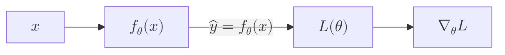
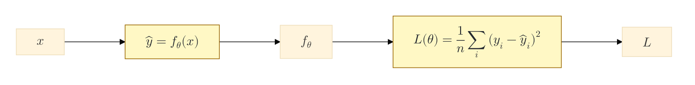
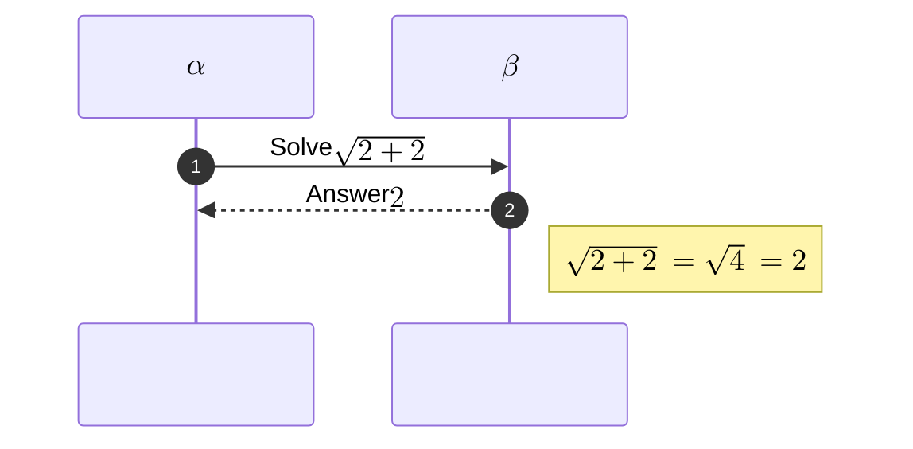
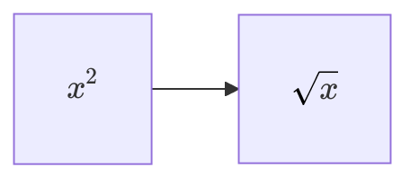

# Mermaid Math Support Guide

Use this guide when node labels, edge labels, sequence participants, messages, or notes need mathematical notation rendered by Mermaid itself.

## What Mermaid Supports

Mermaid math support is **KaTeX-backed** and documented for Mermaid **v10.9.0+**.

Mermaid-native math syntax:

```text
$$LaTeX expression$$
```

Supported diagram types in Mermaid docs:

| Diagram type | Mermaid math support |
| --- | --- |
| `flowchart` / `graph` | Supported in node labels and edge labels |
| `sequenceDiagram` | Supported in participant aliases, messages, and notes |
| Other diagram types | Treat as unsupported until verified in the target renderer |

Mermaid math is **not MathJax-native**. A page or documentation system may use MathJax for surrounding Markdown, but Mermaid's documented in-diagram math renderer is KaTeX.

## When To Use Mermaid Math

Use Mermaid math when:

- The diagram is a flowchart or sequence diagram.
- The formula is short enough to remain readable inside a node, edge, message, or note.
- The final renderer can be tested before publishing.
- The diagram remains understandable if the renderer falls back poorly and you need to export an image instead.

Do not use Mermaid math when:

- The target renderer is GitHub Markdown and exact math rendering is required. GitHub support is currently unreliable; Mermaid issue [`#5482`](https://github.com/mermaid-js/mermaid/issues/5482) reports KaTeX not rendering on GitHub.
- The formula is long, multi-line, or derivation-heavy and cannot be moved into a dedicated formula node.
- The diagram type is not flowchart or sequence.
- The label mixes Markdown formatting with math; Mermaid issue [`#7046`](https://github.com/mermaid-js/mermaid/issues/7046) reports parser/rendering bugs when Markdown and KaTeX math are combined.
- The label contains several separate formulas and prose in one text block; split it into shorter labels or a dedicated formula node.
- You need advanced KaTeX constructs known to be fragile in Mermaid, such as some arrays, `\hline`, vertical table rules, or `\vdots`; see Mermaid issue [`#5424`](https://github.com/mermaid-js/mermaid/issues/5424).

## Flowchart Syntax

Use quoted node labels and quoted edge labels. Wrap only the math expression in `$$...$$`.

Use short edge labels only when the formula fits naturally on the edge.

````markdown

````

Mermaid flowchart edge labels sit on the edge. There is no portable below-edge label option. For larger expressions, move the formula into its own node and use spacing config for readability.

````markdown

````

## Sequence Syntax

Use math in participant aliases, messages, and notes. In actual Mermaid source, use single LaTeX backslashes such as `\sqrt`, `\alpha`, and `\theta`.

Do not wrap the entire sequence message or note in quotes unless the target renderer proves it needs that. Local `mmdc` renders those quotes visibly.

````markdown

````

Known caveat: sequence notes with math can produce excessive padding; see Mermaid issue [`#6993`](https://github.com/mermaid-js/mermaid/issues/6993).

Avoid this in real Mermaid fences unless you are escaping a string literal in another language:

```text
A->>B: Solve $$\\sqrt{2+2}$$
```

That doubled backslash pattern caused a local `mmdc` KaTeX parse failure during fixture testing.

## Renderer Support Matrix

| Renderer | Expected Mermaid math behavior |
| --- | --- |
| Mermaid Live | Usually supported when running Mermaid v10.9.0+ |
| `mmdc` | Supported when installed Mermaid CLI bundles Mermaid v10.9.0+ |
| VS Code preview | Depends on Mermaid extension/plugin version; test before relying on it |
| Obsidian | Depends on bundled Mermaid version and plugin behavior; test before relying on it |
| GitHub Markdown | Treat as unreliable/unsupported for exact Mermaid math; issue [`#5482`](https://github.com/mermaid-js/mermaid/issues/5482) reports KaTeX not rendering |
| Static site builds | Supported only if the site uses Mermaid v10.9.0+ and the build/browser setup preserves Mermaid math rendering |

## MathML And KaTeX CSS Config

Mermaid renders math through KaTeX but, by default, Mermaid's docs say **MathML** is used for mathematical expressions.

Use these config options only when you control the renderer/site setup:

| Config | When to use | Requirement |
| --- | --- | --- |
| `legacyMathML: true` | Fall back to CSS rendering for browsers without MathML support | You must provide KaTeX CSS yourself |
| `forceLegacyMathML: true` | Force KaTeX CSS rendering for more consistent cross-browser output | You must provide KaTeX CSS yourself |

Example for controlled HTML/site builds:

````markdown

````

Do not add `legacyMathML` or `forceLegacyMathML` in generic Markdown unless the target renderer provides the matching KaTeX stylesheet. Mermaid docs explicitly say KaTeX stylesheets are not bundled for these legacy CSS modes.

These options do not make GitHub Markdown reliable. GitHub does not let a Markdown document include the required KaTeX stylesheet, and its Mermaid/SVG rendering pipeline may sanitize the CSS or font declarations that KaTeX needs. For exact GitHub output, export the Mermaid diagram to SVG/PNG with a renderer that supports KaTeX and commit/link that image instead.

## Known Bugs And Friction Points

Use these as caution flags when generating diagrams:

- Mermaid `#5482`: KaTeX does not render on GitHub despite Mermaid v10.9.0 support.
- Mermaid `#7046`: Markdown formatting and KaTeX math can conflict when mixed in the same label/message.
- Mermaid `#6993`: sequence diagram math in notes can create excessive padding.
- Mermaid `#5424`: some advanced table/array notation, including vertical lines and `\vdots`, may not render.
- Mermaid `#5868`: some subscripted Greek-letter cases can cause errors.
- Mermaid `#5383`: Mermaid v10.9.0 KaTeX changes caused friction in Chrome extension injection contexts.

## Generation Rules

- Use Mermaid math only for flowcharts and sequence diagrams unless the user confirms a tested renderer.
- Treat Mermaid v10.9.0+ as a renderer validation requirement, not as a reason to avoid math when the final renderer can be tested.
- Prefer one `$$...$$` expression per label.
- Quote flowchart labels containing math.
- Keep long flowchart formulas in dedicated formula nodes instead of edge labels.
- Use unquoted sequence messages/notes with single LaTeX backslashes in actual Mermaid source.
- Do not mix Markdown formatting and Mermaid math in the same label/message.
- Keep node formulas short; move derivations outside the diagram.
- Ask before targeting GitHub Markdown with in-diagram math; recommend SVG/PNG export for exact math rendering.
- Validate math diagrams with Mermaid Live, `mmdc`, or the final renderer before publishing.

For starting points, use [../templates/flowchart-math-katex.md](../templates/flowchart-math-katex.md) or [../templates/sequence-math-katex.md](../templates/sequence-math-katex.md).
