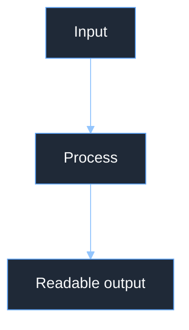
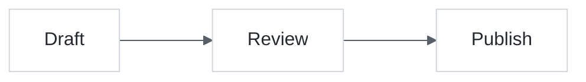

# Mermaid Styling and Readability Guide

Use this guide when the semantic diagram type is correct but the rendered result is too large, too cramped, too faint, or unreadable on the target background.

## Styling Hierarchy

Apply styling and readability changes in this order:

1. **Semantic diagram type** — confirm that the diagram type matches the meaning of the content.
2. **Readability and fit config** — tune spacing, wrapping, padding, edge curves, and direction so the diagram fits and labels can be read.
3. **Theme palette** — set readable colors for a known light or dark background.
4. **Semantic node classes** — use `classDef` only when node categories carry meaning, such as input, process, warning, database, CPU, or GPU.

Do not use CSS as a normal skill path. This skill standardizes Mermaid-native config and `classDef` only.

## When To Add Styling Config

Add readability config when:

- The diagram is too large or too small for the target space.
- Nodes are too cramped or too far apart.
- Edge layers are too compressed or too sparse.
- Labels wrap badly, overflow, or make nodes huge.
- Edges are hard to follow because curve/routing choices create clutter.

Add a theme palette when:

- Node text blends into node fill or page background.
- Edge labels are hard to read against the canvas.
- Diagram is intended for a fixed dark slide, report, or exported image.
- Default Mermaid colors conflict with GitHub dark/light rendering.
- Repeated diagrams need consistent visual identity.

Add `classDef` when:

- Node categories have domain meaning.
- A small number of classes repeat across the diagram.
- The global palette is already readable.

Do not add styling config when:

- The problem is semantic. Choose the right diagram type first.
- The target renderer is unknown and defaults are acceptable.

## Readability Checklist

- Text color must contrast with node fill.
- Edge color must contrast with the canvas.
- Edge label background must contrast with both label text and crossing edges.
- Avoid pale text on pale nodes and white labels on cream nodes.
- Keep line width and borders visible on the target background.
- Prefer simple palettes before per-node decoration.
- Validate the rendered diagram in the target theme when publishing.

## Common Readability Config

Use these keys as the first pass before experimenting with layout engines or renderer-specific hacks.

| Need | Config |
| --- | --- |
| Fixed palette | `theme: base` + `themeVariables` |
| Increase or decrease node spacing | `flowchart.nodeSpacing` |
| Increase or decrease layer spacing | `flowchart.rankSpacing` |
| Increase or decrease outside padding | `flowchart.diagramPadding` |
| Better label wrapping | `flowchart.wrappingWidth` and `markdownAutoWrap` |
| Different edge shape | `flowchart.curve` |
| Semantic node classes | `classDef` + `class` |

Prefer top-level `htmlLabels` and `markdownAutoWrap` where supported. Older examples may put similar keys under `flowchart`; treat that as legacy and test before publishing.

## Dark Background Palette

Use this when the diagram sits on a dark report, presentation, or editor background.

````markdown

````

## Light Background Palette

Use this when the diagram appears on a white or GitHub-like light background.

````markdown

````

## Unreadable Diagram Repair Recipe

When a diagram renders like the neural-network example with dark canvas, pale nodes, and faint text:

1. Identify the target background: GitHub light, GitHub dark, dark slide, or print.
2. Choose a palette template from [../templates/README.md](../templates/README.md).
3. Set node text explicitly with `primaryTextColor` and `nodeTextColor`.
4. Set edge contrast with `lineColor` and `edgeLabelBackground`.
5. Adjust spacing with `nodeSpacing`, `rankSpacing`, or `diagramPadding` before changing layout type.
6. Use `classDef` only for semantic node categories after the base palette is readable.
7. Validate in the target renderer.

Avoid duplicate keys such as two `wrappingWidth` entries in the same object. Avoid undocumented sizing hacks such as `useWidth`, `assetWidth`, or SVG-like `w/h/r/rx/ry` unless the exact Mermaid version and renderer are known.
