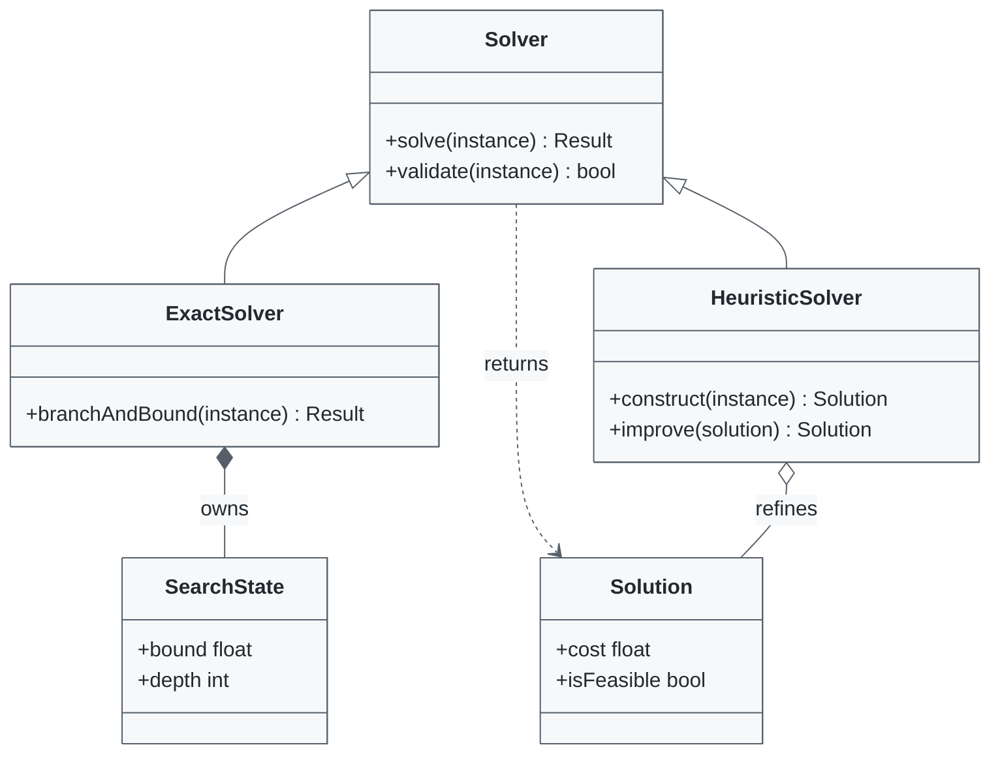

# Class Model Template

Use when modeling classes, attributes, methods, and inheritance.

```mermaid
---
config:
  theme: base
  themeVariables:
    primaryColor: "#f6f8fa"
    primaryTextColor: "#24292f"
    primaryBorderColor: "#57606a"
    lineColor: "#57606a"
---
classDiagram
    class Solver {
        +solve(instance) Result
        +validate(instance) bool
    }

    class ExactSolver {
        +branchAndBound(instance) Result
    }

    class HeuristicSolver {
        +construct(instance) Solution
        +improve(solution) Solution
    }

    class Solution {
        +cost float
        +isFeasible bool
    }

    class SearchState {
        +bound float
        +depth int
    }

    Solver <|-- ExactSolver
    Solver <|-- HeuristicSolver
    ExactSolver *-- SearchState : owns
    Solver ..> Solution : returns
    HeuristicSolver o-- Solution : refines
```
