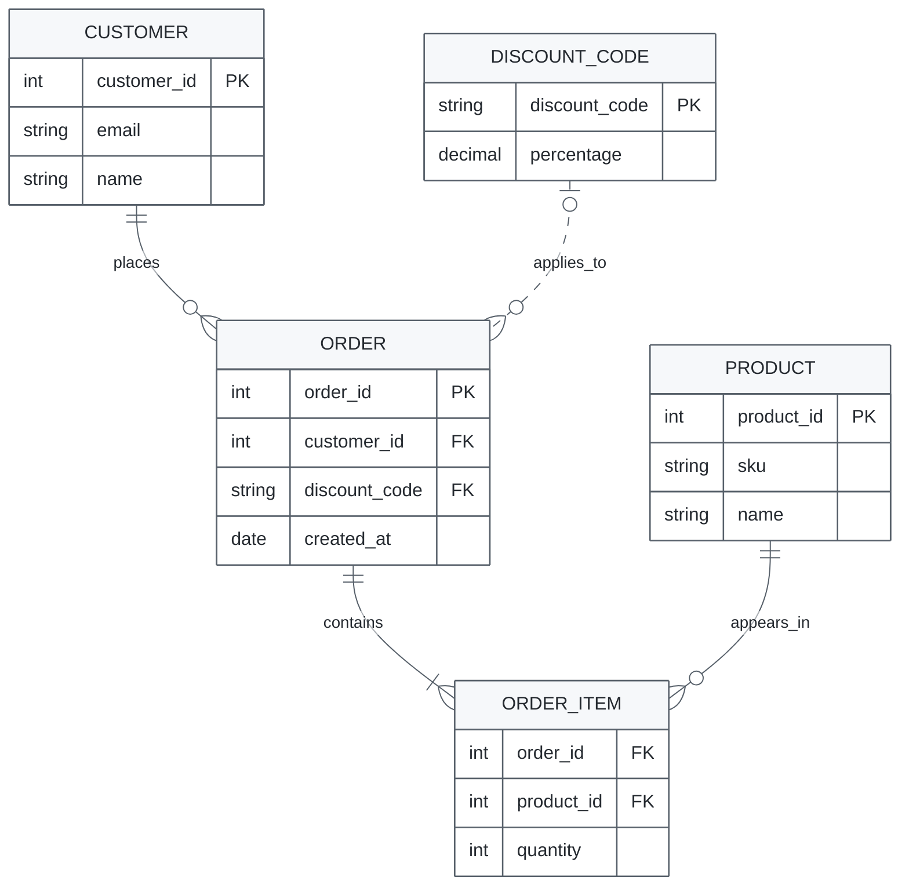

# Entity Relationship Template

Use when modeling tables, primary keys, foreign keys, and cardinality.

```mermaid
---
config:
  theme: base
  themeVariables:
    primaryColor: "#f6f8fa"
    primaryTextColor: "#24292f"
    primaryBorderColor: "#57606a"
    lineColor: "#57606a"
---
erDiagram
    CUSTOMER ||--o{ ORDER : places
    ORDER ||--|{ ORDER_ITEM : contains
    PRODUCT ||--o{ ORDER_ITEM : appears_in
    DISCOUNT_CODE |o..o{ ORDER : applies_to

    CUSTOMER {
        int customer_id PK
        string email
        string name
    }

    ORDER {
        int order_id PK
        int customer_id FK
        string discount_code FK
        date created_at
    }

    ORDER_ITEM {
        int order_id FK
        int product_id FK
        int quantity
    }

    PRODUCT {
        int product_id PK
        string sku
        string name
    }

    DISCOUNT_CODE {
        string discount_code PK
        decimal percentage
    }
```
