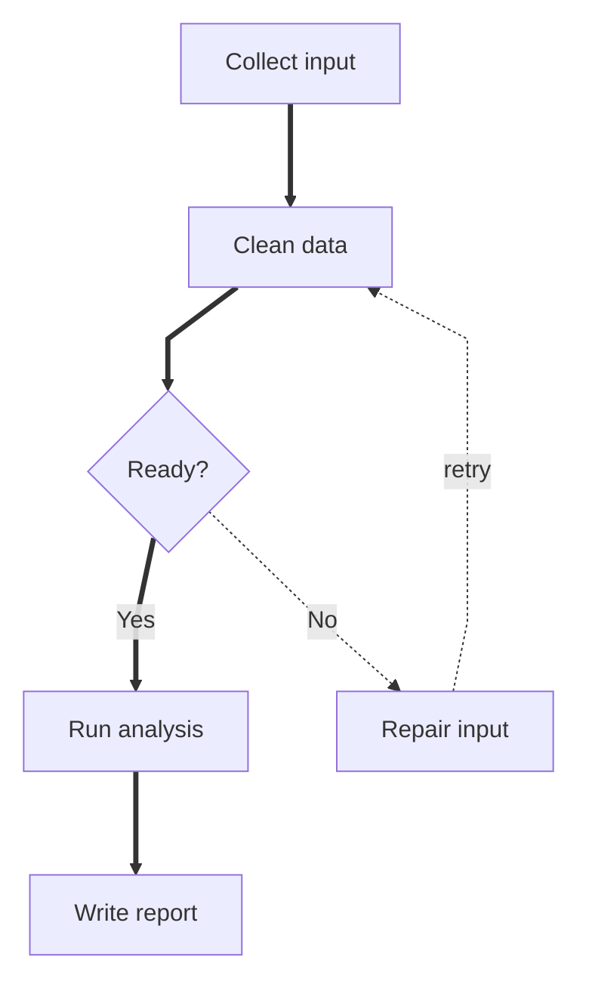

# Flowchart Dagre Default Template

Use this when the diagram is a normal layered process, pipeline, or decision flow. This is the safest default for portable Markdown.

Do not use this when the graph is a dense undirected relationship map or when edge crossings make the default layout unreadable.

Variables shown here are flowchart controls, not a separate dagre-specific object. Use them to tune fit before changing layout engines.
