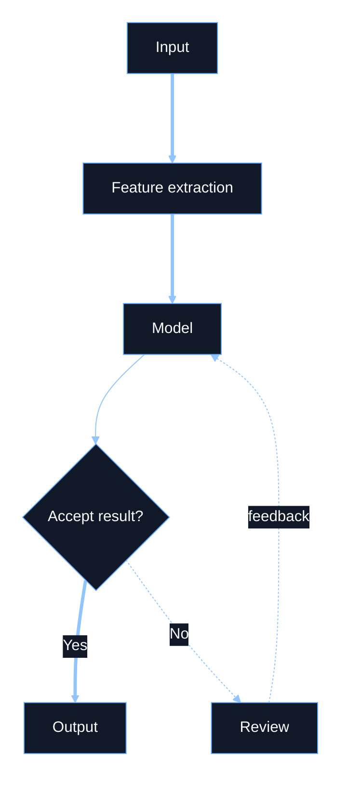

# Flowchart Dark Slide Template

Use for presentations, dark reports, or exported images where readability matters more than default renderer theming.

```mermaid
---
config:
  theme: base
  themeVariables:
    background: "#111827"
    mainBkg: "#111827"
    primaryColor: "#1f2937"
    primaryTextColor: "#f9fafb"
    primaryBorderColor: "#60a5fa"
    lineColor: "#93c5fd"
    edgeLabelBackground: "#111827"
    nodeTextColor: "#f9fafb"
    clusterBkg: "#111827"
    clusterBorder: "#374151"
    titleColor: "#f9fafb"
  flowchart:
    nodeSpacing: 85
    rankSpacing: 95
    diagramPadding: 24
    curve: "basis"
---
flowchart TD
  Input[Input] ==> Feature[Feature extraction]
  Feature ==> Model[Model]
  Model --> Decision{Accept result?}
  Decision == Yes ==> Output[Output]
  Decision -. No .-> Review[Review]
  Review -. feedback .-> Model
```
