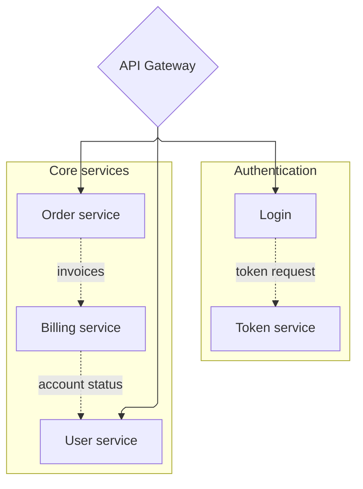

# Flowchart ELK Complex Routing Template

Ask before using this layout unless the user explicitly requests ELK. Use it when a directed flowchart or service dependency map has many crossings under the default layout.

Do not use this as a first choice for simple processes, GitHub-safe output, or unknown renderers.

Documented ELK keys include `mergeEdges`, `nodePlacementStrategy`, `cycleBreakingStrategy`, `forceNodeModelOrder`, and `considerModelOrder`. Validate in the target renderer.
