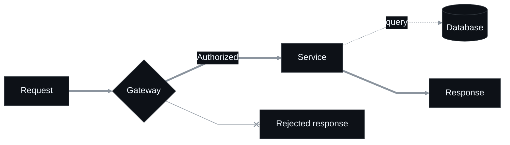

# Flowchart GitHub Dark Template

Use when the rendered diagram must keep a fixed GitHub-dark-like palette.

```mermaid
---
config:
  theme: base
  themeVariables:
    background: "#0d1117"
    mainBkg: "#0d1117"
    primaryColor: "#161b22"
    primaryTextColor: "#f0f6fc"
    primaryBorderColor: "#30363d"
    lineColor: "#8b949e"
    edgeLabelBackground: "#0d1117"
    nodeTextColor: "#f0f6fc"
    clusterBkg: "#0d1117"
    clusterBorder: "#30363d"
    titleColor: "#f0f6fc"
  flowchart:
    nodeSpacing: 70
    rankSpacing: 80
    curve: "linear"
---
flowchart LR
  Request[Request] ==> Gateway{Gateway}
  Gateway == Authorized ==> Service[Service]
  Gateway --x Error[Rejected response]
  Service -. query .-> Database[(Database)]
  Service ==> Response[Response]
```
