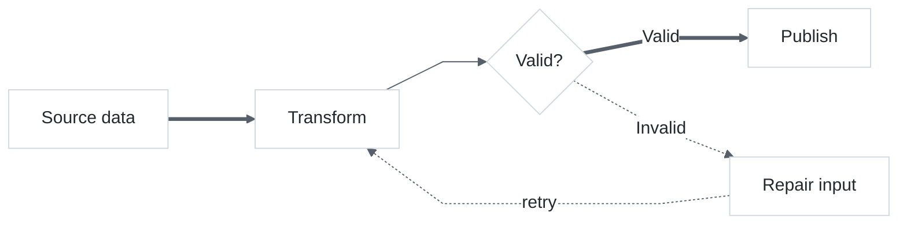

# Flowchart GitHub Light Template

Use when the rendered diagram must keep a fixed light palette.

```mermaid
---
config:
  theme: base
  themeVariables:
    background: "#ffffff"
    mainBkg: "#ffffff"
    primaryColor: "#f6f8fa"
    primaryTextColor: "#24292f"
    primaryBorderColor: "#d0d7de"
    lineColor: "#57606a"
    edgeLabelBackground: "#ffffff"
    nodeTextColor: "#24292f"
    clusterBkg: "#ffffff"
    clusterBorder: "#d0d7de"
    titleColor: "#24292f"
  flowchart:
    nodeSpacing: 70
    rankSpacing: 80
    curve: "linear"
---
flowchart LR
  Source[Source data] ==> Transform[Transform]
  Transform --> Validate{Valid?}
  Validate == Valid ==> Publish[Publish]
  Validate -. Invalid .-> Repair[Repair input]
  Repair -. retry .-> Transform
```
