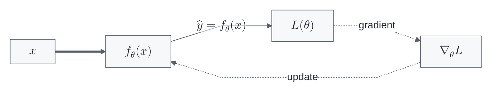
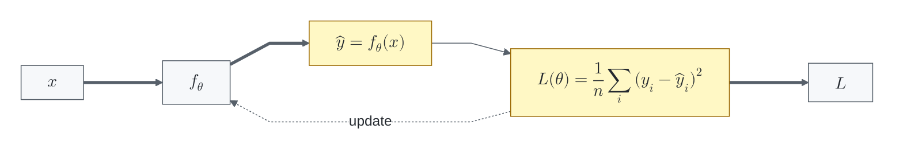

# Flowchart Math KaTeX Template

Use when a flowchart needs Mermaid-native math expressions in nodes or edge labels.

Requirements:

- Mermaid v10.9.0 or newer.
- Target renderer tested for Mermaid math support.
- One short `$$...$$` expression per edge label when possible.
- Dedicated formula nodes for long expressions that would crowd an edge.

Do not use this for GitHub Markdown when exact math rendering is required; Mermaid issue `#5482` reports GitHub KaTeX rendering problems.

## Short Edge-Label Pattern

## Formula-Node Pattern

Use this when an edge label becomes too long. Mermaid does not provide a portable below-edge label option, so a dedicated node is usually clearer.

