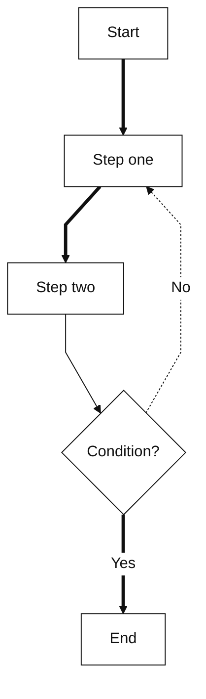

# Flowchart Print Friendly Template

Use when diagrams must remain legible in exported PDFs or black-and-white printing.

```mermaid
---
config:
  theme: base
  themeVariables:
    background: "#ffffff"
    mainBkg: "#ffffff"
    primaryColor: "#ffffff"
    primaryTextColor: "#111111"
    primaryBorderColor: "#111111"
    lineColor: "#111111"
    edgeLabelBackground: "#ffffff"
    nodeTextColor: "#111111"
    clusterBkg: "#ffffff"
    clusterBorder: "#111111"
    titleColor: "#111111"
  flowchart:
    nodeSpacing: 80
    rankSpacing: 80
    curve: "linear"
---
flowchart TD
  Start[Start] ==> StepOne[Step one]
  StepOne ==> StepTwo[Step two]
  StepTwo --> Decision{Condition?}
  Decision == Yes ==> End[End]
  Decision -. No .-> StepOne
```
