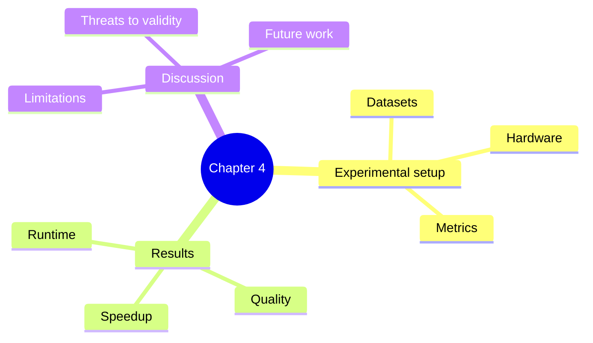

# Mindmap Tidy-Tree Hierarchy Template

Ask before using this layout unless the user explicitly requests a hierarchy or mindmap. Use it for concept trees where parent-child structure matters more than process flow.

Do not use this for multi-actor messaging, database schema, or ordered algorithms.

Official Mermaid docs mainly show tidy-tree with mindmaps. Do not claim `tidy-tree.direction`, `tidy-tree.levelSpacing`, or `tidy-tree.nodeSpacing` are portable unless the target renderer has been tested.
