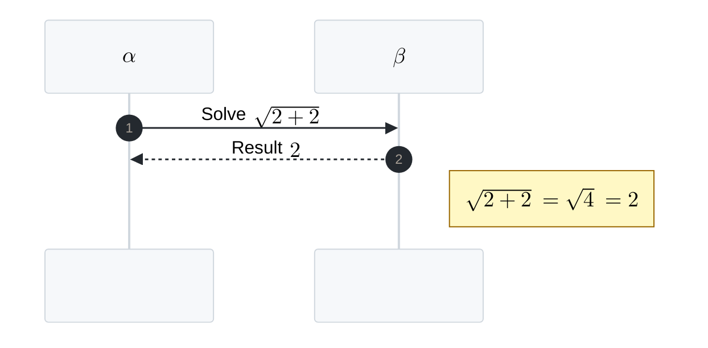

# Sequence Math KaTeX Template

Use when a sequence diagram needs short Mermaid-native math expressions in participant aliases, messages, or notes.

Requirements:

- Mermaid v10.9.0 or newer.
- Target renderer tested for Mermaid math support.
- Single LaTeX backslashes in actual Mermaid source, for example `\sqrt` and `\alpha`.
- Unquoted messages and notes; local `mmdc` renders wrapping quotes visibly.
- Notes with math checked for excessive padding.

Do not use this for GitHub Markdown when exact math rendering is required; Mermaid issue `#5482` reports GitHub KaTeX rendering problems.

>[!TIP] on `$$\ \sqrt{2+2}$$`
>the `\ ...` is necessary for spacing, otherwise it would be rendered altogether.
