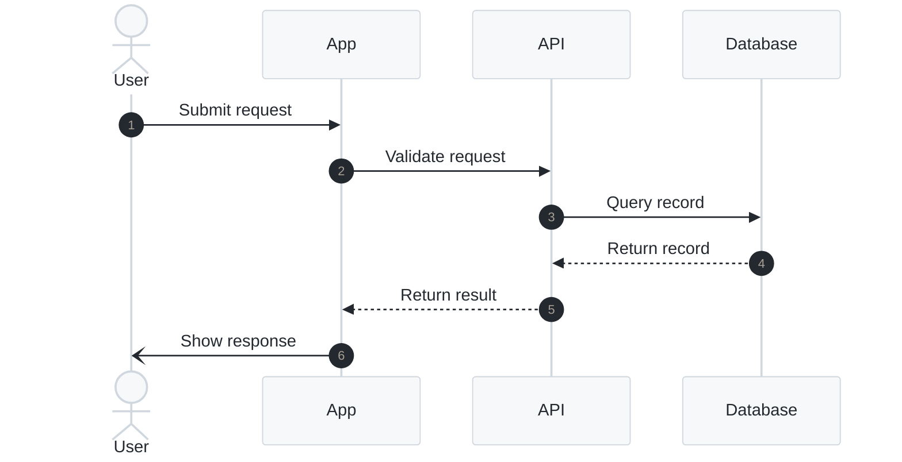

# Sequence Service Call Template

Use when two or more participants exchange messages over time.

```mermaid
---
config:
  theme: base
  themeVariables:
    primaryColor: "#f6f8fa"
    primaryTextColor: "#24292f"
    primaryBorderColor: "#d0d7de"
    lineColor: "#57606a"
---
sequenceDiagram
    autonumber
    actor User
    participant App
    participant API
    participant Database

    User->>App: Submit request
    App->>API: Validate request
    API->>Database: Query record
    Database-->>API: Return record
    API-->>App: Return result
    App-)User: Show response
```
