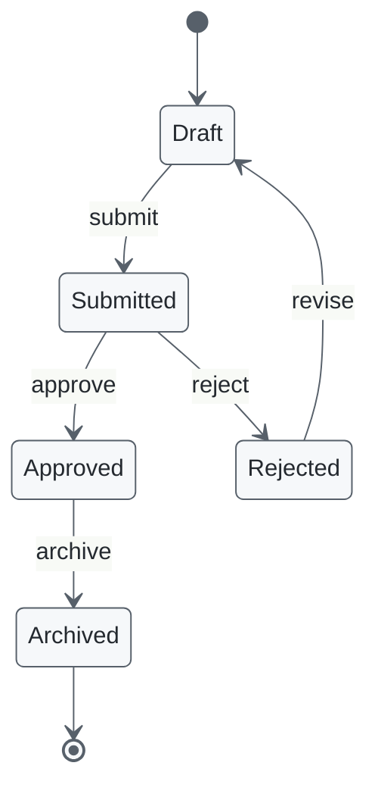

# State Lifecycle Template

Use when boxes are states or conditions, not actions.

```mermaid
---
config:
  theme: base
  themeVariables:
    primaryColor: "#f6f8fa"
    primaryTextColor: "#24292f"
    primaryBorderColor: "#57606a"
    lineColor: "#57606a"
---
stateDiagram-v2
    [*] --> Draft
    Draft --> Submitted: submit
    Submitted --> Approved: approve
    Submitted --> Rejected: reject
    Rejected --> Draft: revise
    Approved --> Archived: archive
    Archived --> [*]
```
