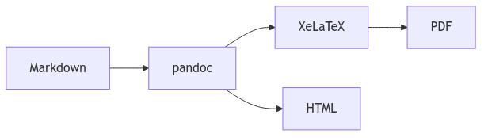

---
# === mermaid-workaround.md — self-documenting template ===
# Demonstrates: the pre-render workflow for Mermaid diagrams.
# Pandoc has no native Mermaid support; `mermaid-filter` works for HTML/standalone PDF
# but is fragile inside beamer frames. The pre-render approach is format-agnostic.
title: "Mermaid Pre-render Workaround"
author: "Template Author"
date: 2026-04-22
lang: en-US
documentclass: article
geometry: margin=2.5cm
fontsize: 11pt
---

# About this template

Pandoc has no first-class Mermaid support. Two strategies exist:

1. **`raghur/mermaid-filter`** — works for HTML and standalone LaTeX PDFs but
   fails inside beamer frames (fragile frame + `\includegraphics` interaction).
2. **Pre-render** (this template) — run `mmdc` once to produce a `.png` and
   embed it as a normal image. Format-agnostic, beamer-safe, CI-friendly.

The pre-render workflow is the recommended default (Phase-0 gap `G-MF-02`).

# Architecture diagram

The flow below is pre-rendered from `diagram.mmd` to `diagram.png`:

{width=75%}

# Pre-render one-liner

The companion Mermaid source (`diagram.mmd`) must be rendered before
`pandoc` runs. One-liner (uncomment and run once per edit):

```bash
# mmdc -i diagram.mmd -o diagram.png -b white
```

## Notes

- `mmdc` is the `@mermaid-js/mermaid-cli` binary; install via
  `npm i -g @mermaid-js/mermaid-cli` if missing.
- `-b white` forces a white background so the PNG prints cleanly.
- For HTML-only targets, the `mermaid-filter` alternative is documented in
  `references/diagrams-and-filters.md` (added in Phase 2).
- Beamer users: stick with pre-render; `mermaid-filter` regularly breaks
  fragile frames.

## Compile

```bash
# 1) render the diagram once
mmdc -i diagram.mmd -o diagram.png -b white

# 2) compile the PDF
pandoc mermaid-workaround.md \
  --pdf-engine=xelatex \
  -o mermaid-workaround.pdf
```
