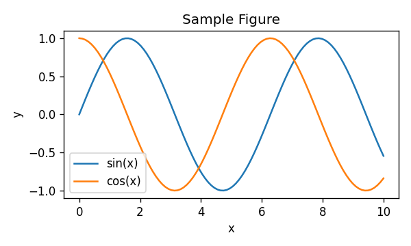

---
# === minimal-thesis.md — self-documenting template ===
# Demonstrates: report class, one chapter, one figure, one pipe table,
# one citation rendered via citeproc + ABNT CSL, one display-math block.
title: "Minimal Thesis Template"
author: "Template Author"
date: 2026-04-22
lang: pt-BR                          # polyglossia picks Portuguese; affects hyphenation and babel labels
documentclass: report                # 'report' gives \chapter; use 'book' for two-sided, 'article' for short papers
geometry: margin=2.5cm               # ABNT-friendly default; override per institution
fontsize: 12pt
linestretch: 1.5                     # 1.5 line spacing is standard for thesis bodies in PT-BR
toc: true                            # generate table of contents
number-sections: true                # number chapters/sections; required for \ref{sec:...}
bibliography:
  - /home/lucas_galdino/chimera/gpu_accelerated/documents_tcc/refs.bib   # absolute: portable across cwds
csl: /home/lucas_galdino/chimera/gpu_accelerated/documents_tcc/associacao-brasileira-de-normas-tecnicas-numerico.csl  # CON-001: reuse repo CSL
link-citations: true                 # turns [@key] into clickable hyperlinks in the PDF
linkcolor: blue
urlcolor: blue
---

# Sobre este template

Este arquivo demonstra o mínimo necessário para compilar uma dissertação/tese
em PDF via `pandoc` + `xelatex` + `citeproc`, incluindo:

- Frontmatter YAML com `documentclass: report`.
- Uma figura PNG embutida.
- Uma tabela em sintaxe *pipe* do pandoc.
- Uma citação bibliográfica resolvida via `refs.bib` + CSL ABNT.
- Um bloco de matemática display.

# Capítulo de Exemplo

## Introdução

Trabalhos clássicos de otimização em GPU fornecem o pano de fundo teórico
para o restante desta demonstração [@tsp_gpu].

## Figura

{#fig:sample width=70%}

A Figura apresenta duas funções trigonométricas para referência.

## Tabela

| Método   | Tempo (s) | Speedup |
|----------|----------:|--------:|
| CPU      |     120.0 |    1.0x |
| GPU      |      12.5 |    9.6x |

## Matemática

A distância euclidiana entre dois pontos no plano é

$$
d(p, q) = \sqrt{(p_x - q_x)^2 + (p_y - q_y)^2}.
$$

# Referências

<!-- citeproc injeta a bibliografia aqui -->

## Notes

- `lang: pt-BR` activates polyglossia (XeLaTeX) for Portuguese hyphenation.
- Absolute paths in `bibliography:` and `csl:` make the template work regardless of `pandoc`'s cwd.
- `{#fig:sample}` is a pandoc attribute; to get numbered figure references, add the `pandoc-crossref` filter (not loaded here to keep the template minimal).
- To switch engines to `lualatex`, change `--pdf-engine=xelatex` in the compile command below.

## Compile

```bash
pandoc minimal-thesis.md \
  --pdf-engine=xelatex \
  --citeproc \
  -o minimal-thesis.pdf
```
