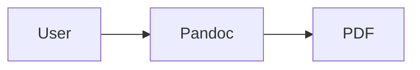
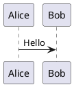

# Diagrams and Lua filters for academic Pandoc

Official pandoc docs: <https://pandoc.org/lua-filters.html>,
<https://pandoc.org/extras.html#lua-filters>, <https://pandoc.org/filters.html>.

This file covers the three diagram stacks this skill supports — **Mermaid**, **TikZ**,
**PlantUML** — plus the generic Lua-filter mechanics pandoc uses to plug them in.

---

## 1. The `pandoc-ext/diagram` Lua filter (Mermaid + PlantUML + more)

Repo: <https://github.com/pandoc-ext/diagram>. Single-file Lua filter that converts fenced
code blocks (` ```mermaid `, ` ```plantuml `, ` ```dot `, ` ```tikz `, ` ```asymptote `) to
images at build time by shelling out to the matching CLI.

### Install

```bash
# Fetch the filter (single file, no package manager needed)
mkdir -p scripts
curl -L https://raw.githubusercontent.com/pandoc-ext/diagram/main/diagram.lua \
  -o scripts/diagram.lua

# Install the diagram engines you use
npm install -g @mermaid-js/mermaid-cli        # provides mmdc
# plantuml: apt-get install plantuml  OR  brew install plantuml
# dot:      apt-get install graphviz
```

### Use

Markdown body:

````markdown



````

Compile:

```bash
pandoc input.md \
  --lua-filter=scripts/diagram.lua \
  --pdf-engine=xelatex \
  -o output.pdf
```

### Gotchas

- **`mmdc` on CI requires Chromium.** Mermaid CLI uses headless Chrome. In Docker, either
  install `chromium` and set `PUPPETEER_EXECUTABLE_PATH`, or pre-render diagrams to PNG
  locally and commit the images.
- **Beamer incompatibility.** Mermaid rendering inside beamer frames is known to break with
  pandoc 3.x — the filter strips the block but Mermaid doesn't always emit the image. **Fix:**
  pre-render with `mmdc -i diagram.mmd -o diagram.png` and embed with ``.
  This repo's thesis presentation uses exactly this workaround (see repo memory).
- **The filter writes temp files to `./`** by default. Use the `diagram.output-dir` metadata
  key to redirect: `--metadata=diagram.output-dir=./build/diagrams`.

---

## 2. TikZ (native LaTeX)

No filter needed for PDF output — pandoc passes raw LaTeX through when the target is
`latex`/`pdf`/`beamer`.

```markdown
\begin{figure}[H]
\centering
\begin{tikzpicture}
  \draw[thick,->] (0,0) -- (4,0) node[right] {$x$};
  \draw[thick,->] (0,0) -- (0,3) node[above] {$y$};
  \draw[domain=0:3.5,smooth] plot (\x, {0.5*\x*\x});
\end{tikzpicture}
\caption{Parabola.}
\label{fig:parabola}
\end{figure}
```

### Required preamble (add to `header-includes:`)

```yaml
header-includes:
  - \usepackage{tikz}
  - \usetikzlibrary{arrows.meta,positioning,shapes.geometric}
  - \usepackage{pgfplots}
  - \pgfplotsset{compat=1.18}
  - \usepackage{float}                 # for [H] placement
```

### Gotchas

- **Beamer `[fragile]` frames** and TikZ mix badly. `[fragile]` is needed for verbatim/code
  blocks; TikZ inside `[fragile]` can silently compile to an empty box. Split code and
  TikZ into two frames.
- **HTML output** drops TikZ silently (raw LaTeX is stripped). To keep TikZ figures for
  multi-format builds, pre-compile each figure to a standalone PDF/SVG with the `standalone`
  LaTeX class, then reference the SVG/PNG from the markdown with ``.
- **`[H]` placement requires `\usepackage{float}`.** Without it, `\begin{figure}[H]` falls
  back to `[htbp]` and the figure floats away from its caption.

---

## 3. Raw Lua filter mechanics

A Pandoc Lua filter is a `.lua` file exposing functions named after AST node types (e.g.,
`Pandoc`, `Meta`, `Header`, `Image`, `RawBlock`, `CodeBlock`, `Para`). Each function receives
the node and returns either a replacement node, a list of nodes, or `nil` (no change).

Minimal example (uppercase all code block languages):

```lua
function CodeBlock(block)
  if block.classes[1] then
    block.classes[1] = block.classes[1]:upper()
    return block
  end
end
```

Invoke with `--lua-filter=path/to/filter.lua`. Multiple filters can be chained; they run in
the order given.

### When to write a custom Lua filter

- Rewriting a raw-LaTeX block for a specific output (see `scripts/beamer-table-fix.lua`).
- Counting or validating document elements (e.g., fail if any `Image` lacks a caption).
- Generating tables of figures / tables / algorithms beyond what pandoc emits natively.
- Post-processing citations after citeproc runs (requires filter order: citeproc first).

### When NOT to write one

- Styling — use a template (`--template=…`) or reference doc (`--reference-doc=…`) instead.
- Bibliography manipulation — `csl` files and the citeproc filter cover 99% of cases.
- Simple text replacement — use sed / the markdown source directly.

---

## 4. Filter alternatives considered

- **`panzer`** (<https://github.com/msprev/panzer>): adds styles + defaults combining.
  Useful for large multi-document repos; overkill for a single thesis. Unmaintained since
  ~2019.
- **`pandocfilters` (python)**: pre-dates Lua filters. Slower (JSON round-trip per
  invocation) and harder to distribute (needs python on `PATH`). Prefer Lua unless the
  filter needs a python library.
- **`pandoc-crossref`**: Haskell filter for auto-numbered cross-references (`@fig:foo`
  syntax). Recommended if the document has many cross-references — install with
  `cabal install pandoc-crossref` and pass `--filter=pandoc-crossref` BEFORE `--citeproc`.

---

## 5. Filter order matters

On the command line, filters run left-to-right. `--citeproc` always runs last unless another
`--filter`/`--lua-filter` follows it. Recommended order for a citing document with
cross-references and diagrams:

```bash
pandoc input.md \
  --lua-filter=scripts/diagram.lua \
  --filter=pandoc-crossref \
  --citeproc \
  --lua-filter=scripts/beamer-table-fix.lua \
  -o output.pdf
```

Rationale:

1. `diagram.lua` first — converts fenced blocks to images before anything else reads them.
2. `pandoc-crossref` second — assigns figure/table numbers using the images from step 1.
3. `--citeproc` third — formats citations; needs crossref done so it can reference numbered
   floats if the style requires it.
4. `beamer-table-fix.lua` last — rewrites the raw LaTeX tables pandoc emits at the very end.

---

## 6. Specialist alternative: `raghur/mermaid-filter`

<rules>

- Prefer **`pandoc-ext/diagram`** (documented above) when the document mixes Mermaid with
  PlantUML, Graphviz, or TikZ — one filter, one pipeline. Why: less to maintain.
- Use **`raghur/mermaid-filter`** when Mermaid is the ONLY diagram stack and you need per-
  diagram configuration (custom CSS, theme, or a pinned Chromium for offline CI). Why: its
  environment variables were designed for these cases.
- **Never load both filters in the same compile command.** They both intercept ` ```mermaid `
  blocks and will double-render (or conflict on file names). Why: deterministic builds.
</rules>

### Install

```bash
npm install -g mermaid-filter
# depends on a reachable Chromium; the filter downloads one via puppeteer at install time
```

### Invoke

```bash
pandoc input.md --filter=mermaid-filter -o output.pdf
```

### Per-project configuration (all optional, read from CWD)

| File                  | Purpose                                                               |
| --------------------- | --------------------------------------------------------------------- |
| `.mermaid-config.json`| Mermaid init options (theme, `flowchart.curve`, `securityLevel`, …)   |
| `.mermaid.css`        | Extra CSS injected into the rendered SVG (colour overrides, fonts)    |
| `.puppeteer.json`     | Puppeteer launch options — point `executablePath` at local Chromium   |

Environment variables override the files on a per-build basis:

| Variable                      | Effect                                                               |
| ----------------------------- | -------------------------------------------------------------------- |
| `MERMAID_FILTER_FORMAT`       | Force output format (`png`, `svg`, `pdf`) regardless of `-t`         |
| `MERMAID_FILTER_THEME`        | Override theme (`default`, `dark`, `forest`, `neutral`)              |
| `MERMAID_FILTER_BACKGROUND`   | Background colour of the rendered image                              |
| `MERMAID_FILTER_WIDTH`/`_HEIGHT` | Fix the output size (useful to stop overflow in beamer frames)    |

### Attribute syntax (for pandoc-crossref integration)

The filter accepts standard pandoc code-block attributes. Giving the block an id lets
`pandoc-crossref` cross-reference it like any other figure:

````markdown
```{.mermaid #fig:pipeline caption="End-to-end pipeline"}
graph LR
  A[Input] --> B[Filter]
  B --> C[Output]
```
````

Then: `See @fig:pipeline for the overall flow.` (with `--filter=pandoc-crossref`).

<gotchas>

- **`.puppeteer.json` is the offline-build escape hatch.** Sandboxed CI workers usually
  forbid puppeteer's Chromium download. Ship a `.puppeteer.json` with
  `{"executablePath": "/usr/bin/chromium"}` (adjust per OS) in the repo root.
- **Filter order vs `pandoc-crossref`.** `mermaid-filter` must run BEFORE
  `pandoc-crossref`; otherwise crossref sees a code block with no figure counter and emits
  `??`. Command-line order: `--filter=mermaid-filter --filter=pandoc-crossref --citeproc`.
- **Beamer limitation is the same as `pandoc-ext/diagram`.** Mermaid inside beamer frames
  is fragile across pandoc minor versions. Pre-render to PNG and embed with
  `{width=80%}` for slide decks — this is the pattern in
  [../templates/mermaid-workaround.md](../templates/mermaid-workaround.md).
- **Output cache lives in `./`.** The filter writes `mermaid-images/` relative to CWD.
  Add it to `.gitignore` or pre-render and commit the PNGs.
</gotchas>

## 7. Mermaid — hybrid / fallback decision tree

<rules>

- **Target is HTML and build has network** → use `pandoc-ext/diagram` with `mmdc` on PATH.
  Simplest path, no pre-rendering. Why: Chromium is available and the HTML viewer renders
  the embedded SVG directly.
- **Target is HTML and build is offline** → either (a) pre-render `.mmd` → `.svg` with
  `mmdc` locally and embed via ``, or (b) use `mermaid-filter` with a
  `.puppeteer.json` pointing to a local Chromium. Why: no live Chromium download at build.
- **Target is standalone PDF (not beamer)** → `pandoc-ext/diagram` with PNG output is the
  shortest path. Verify `mmdc` is on PATH first. Why: XeLaTeX embeds the PNG cleanly.
- **Target is beamer** → pre-render PNG and embed with `{width=80%}`. Do
  NOT rely on either Mermaid filter inside a `[fragile]` frame. Why: pandoc 3.x strips the
  block but the rendered image is intermittently missing; the pre-render workaround is the
  thesis-presentation pattern documented in repo memory.
- **Target is multi-format (PDF + HTML + EPUB)** → pre-render once, commit the image
  alongside the source, and embed via ``. Filters won't run on every format anyway
  (beamer breaks them), so one asset serves all formats. Why: deterministic builds.
</rules>
